# C++ Basic Tutorial

**Note:** 
 - This Tutorial is mainly Practical.
 - Give a STAR if you like this 
 - FORK to get more update
 - Make a PULL REQUEST to countribute


<br>

### Put your phone in desktop mode for easy access

<br>


<hr>

<details>
<summary><b> Syntax of C++ Language </b></summary>
<br>
<div align="left">
   
</div>
<br>

- **iostream**
	1. It stands for input output stream
	2. It is a collection of predefined functions/methods
	3. It is also called library of C++
	
- **include**
	1. To include the header file into the program
	
- **#**
	1. It is called preprocessor
	2. It includes the library of C++ into the program before the execution of program
	
- **conio**
	1. It stsands for console input output
	2. It is used to show the ouput on console window
	
- **void**
	1. It is a keyword 
	2. It indicate that no one value is being returned by the function
	3. If we use anyother keyword like `int, float, char` etc in place of void then we will use return keyword
	
- **main**
	1. It is the function which is called the entry point of any program
	2. The execution of any program starts from the main function
	3. If in a program there is only one function then it should be main function

- **clrscr**  
	1. It stands for clear screen
	2. It is a predefined function which is used to clear the output screen
	3. It acts like a duster on output screen
	3. It is define in the `conio.h` header file

- **cout**
	1. It is a keyword which is used to print data or information on the output screen
	2. It is always use with insertion operator
	3. `cout` (pronounced "see-out")

- **getch**
	1. It is a predefine function which is used to hold the output screen
	2. It acts like a duster on the output screen
	3. It is define in the `conio.h` header file


- **Remember:**  
	- The compiler ignores white spaces. However, multiple lines makes the code more readable.
	- Every C++ statement ends with a semicolon (;)
  

</details>


<hr>

<details><summary><b>Comments in C++</b></summary>

  - **Definition**
      * Comments can be used to explain C++ code, and to make it more readable. 
      * It can also be used to prevent execution when testing alternative code.
      * Comments can be singled-lined or multi-lined.
 


  1. Single-line comments start with two forward slashes (//).
 
 		```

		 // This is a comment
		cout << "Hello World!";

		 ```
 
  2. Multi-line comments start with /* and ends with */.
 
 		```

 		/* The code below will print the words Hello World!
		to the screen, and it is amazing */
		cout << "Hello World!";

 		```

</details>


<hr>

<details><summary><b>Variables in C++</b></summary>

  - <details><summary><b>Variables</b></summary>

      - **Definition**
     	1. It is a name of storage space which is used to store data
     	2. It's value is changable
     	3. It always contains last value stored to it
     	4. It's always declare with data type

	  - In C++, there are different types of variables (defined with different keywords), for example:

        * `int` - stores integers (whole numbers), without decimals, such as 123 or -123
        * `double` - stores floating point numbers, with decimals, such as 19.99 or -19.99
        * `char` - stores single characters, such as 'a' or 'B'. Char values are surrounded by single quotes
        * `string` - stores text, such as "Hello World". String values are surrounded by double quotes
        * `bool` - stores values with two states: true or false

      - **Varable Declaration**

		```
			int rollno;
			float marks;
			char grade;
	
		```

		Here:
        - rollno is a variable of type int
        - marks is a variable of type float
        -  grade is a variable of type char

      - **Variable Initialization**

		```
			int rollno=201
			float marks=85.6
			char grade='A'

		```

		Here:
        - 201 is the value of rollno
        - 85.6 is the value of marks
        - A is the value of grade (Character value is always written in single quotes)

      - **Rules to declare a variable**
     	1. The first letter of a variable should be alphabet or underscore(_)
     	2. The first letter of a variable should not be digit
     	3. After first character it may be combination of alphabets and digits
     	4. Blank space are not allowed in variable name 
     	5. Variable name should not be a keyword 


	 - **To create a variable, specify the type and assign it a value:**

 		`type variableName = value;`
 
 		**Note:** Where `type` is one of C++ types (such as `int`), and `variableName` is the name of the variable (such as x or myName). The equal sign is used to assign values to the variable.
 
 			**Example 1**

			Create a variable called x of type int and assign it the value 15:
			```
			#include <iostream>
			using namespace std;

			int main() {
  				int myNum = 15;
  				cout << myNum;
  				return 0;
			}

			```

	</details>

  - <details><summary><b>Constant in C++</b></summary>

      - **Definition**
        1. An elemnt of program whose value can not be changed at the time of execution of program is called constant
        2. It is also called 'literals'
        3. It may be int, float and char data type

      - **Rules for constructing integer constant**
        1. It must have atleast one digit
        2. It must not have a decimal point
        3. It may be positive (+ve) or negative (-ve)
        4. The range of integer constant is between -32768 to +32767
        5. No comma or blank sppace are allowed in integer constant

      - **Rules for constructing floating constant**
        1. It must have atleast one digit
        2. It must not have a decimal point
        3. It may be positive or negative
        4. No comma or blank sppace are allowed in floating constant


      - **Rules for constructing character constant**
        1. It is a single alphabet, digit, or special symbol
        2. The length of character constant is 1 character
        3. Charcter constant is enclosed within single quotes (Example: char c='A';)


      - **Use of constant in program**
		There are two way of using constants in the C/C++ program 

        - Using const
        - Using #define


    </details>


  - <details><summary><b>Storage Classes in C++</b></summary>

      - **Definition**
		A storage classes in C++ defines the **scope, lifetime, default initial value** and **storage space** of a variable.

		There are four storage classes in C++:
        1. automatic
        2. static
        3. register
        4. external

        - **automatic:storage class**
          1. Automatic variables are declared inside a function in which they havae to used
          2. When the function is called automatic variables are created and destroy when function is exited
          3. Automatic variables can nt be used outside that function in which its declared. It means w can say that it is private member
          4. Automatic variables are also known as local variable
          5. `auto` keyword is usd to declare automatic ttype variable
   
			<br>
       		<div align="left">
   			
			</div>
			<br>


        - **Example**
        
			```
			#include<iostream>
			using namespace std;
			int main()
			{
				auto int x=5;
				{
					auto int x=3;
					{
						auto x=1;
						cout<<x<<end1;
					}
					cout<<x<<end1;
				}
				cout<<x<<end1;
			}


			/*
			### Output ###
			1
			3
			5
			*/
			```

			Here the value of innermost x is 1, out of this block value is 3 and out of this block is 5.


		- **static:storage class**
          1. Static variables can be used anywhere in the program inside or outside of a function or block
          2. The value of a static variable exits untill the end of program
          3. The satic variable which is declared inside a function is called "internal static variable" and it can not be used outside that function
          4. The static variable which is declared outside a function is called external variable" and it can be used in all the function of that program
   
			<br>
       		<div align="left">
   			
			</div>
			<br>


        - **Example**
        
			```
			#include<iostream>
			using namespace std;
			void demo()
			{
				static it x=0;
				cout<<x<<end1;
				x++;
			}
			int main()
			{
				Demo(); 	// calling
				Demo();
				Demo();
				Demo();
			}
			


			/*
			### Output ###
			0
			1
			2
			3
			*/
			```

			Here the Demo function is called four times and each time value is incremented by one.


		- **Register:storage class**
          1. registr variables is stored in one of the register of system, instead of memory
          2. Value stored in register can be accessed faster than one that is stored in memory
   
			<br>
       		<div align="left">
   			
			</div>
			<br>


        - **Example**
        
			```
			#include<iostream>
			using namespace std;
			int main()
			{
				register int x,y=20,z=30;
				x=y+z;
				cout<<"Add="<<x
			}
			


			/*
			### Output ###
			Add=50
			*/
			```

			

		- **external:storage class**
          1. Variable that can be used any where in the program is called external variable
          2. External storage class does not create a variable, but its inform the compiler of its existence
          3. `extern` keyword is used to declare external variable 


			<br>
       		<div align="left">
   			
			</div>
			<br>


        - **Example**
        
			```
			#include<iostream>
			using namespace std;
			int x=10; 	// extarnal variable
			int main()
			{
				extern int x=5;
				cout<<x;
			}
			


			/*
			### Output ###
			5
			*/
			```


    </details>

</details>


<hr>

<details><summary><b>Keyword in C++</b></summary>

- **Definition**
	1. The word that has a predefined meaning is called keywords
	2. It's functionality is also predefined
	3. It can not be used as an identifier

- **Keywords in C++ are givien below:**

	```
	1. default
	2. float
	3. register
	4. struct
	5. volatile
	6. break
	7. do
	8. for
	9. return
	10. switch
	11. while
	12. case
	13. double
	14. goto
	15. short
	16. typedef
	17. char
	18. else
	19. if
	20. signed
	21. union
	22. const
	23. enum
	24. int
	25. sizeof
	26. unsigned
	27. countinue
	28. extern
	29. long
	30. static
	31. void
	32. auto

	```


</details>


<hr>

<details><summary><b>Data Types in C++</b></summary>

- **Definition**
	1. It is a type of data which is used in the program
	2. There are many predefined data types in C/C++ library like `int,char, float` etc
	
	<br><Br>

	<div align="left">
    
	</div>
	<br>

- **Integer Type**

	<br>
	<div align="left">
    
	</div>
	<br>


- **Float Type**

	<br>
	<div align="left">
    
	</div>
	<br>


- **Character Type**

	<br>
	<div align="left">
    
	</div>
	<br>


</details>


<hr>

<details><summary><b>Operator in C++</b></summary>

<br>
	<div align="left">
   	
	</div>
	<br>

- **Operator**
	It is a special symbol which is used to perform logical or mathematical operation on data or variable.

- **operand**
	It is a data or variable on which the operation is to be performed.

- **Types of Operator**
	- Arithmetic Operators
	- Relational Operators
	- Logical Operators
	- Assignment Operators
	- Bitwise Operators
	- Increment/Decrement Operators
	- Conditional Operators
	- Special Operators

<br>


- **Arithmetic Operators**

	<br>
	<div align="left">
    
	</div>
	<br>

	```
	#include<iostream>
	using namespace std;
	int main()
	{
		int a=5,b=3;
		cout<<(a+b)<<"\n";
		cout<<(a-b)<<"\n";
		cout<<(a*b)<<"\n";
		cout<<(a/b)<<"\n";
		cout<<(a%b)<<"\n"; 	// %(modulus) holds remainder
	}

	/*
	### Output ###
	8
	2
	15
	1
	2
	*/
	```


	<br>

- **Relational Operators**

	<br>
	<div align="left">
    
	</div>
	<br>


<br>


- **Logical Operators**

	<br>
	<div align="left">
    
	</div>
	<br>
	
	```
	#include<iostream>
	using namespace std;
	int main()
	{
		int a=10,b=50,c=30;
		if(a>b&&a>c)
		cout<<"a is greater";
		if(b>a&&b>c)
		cout<<"b is greater";
		if(c>a&&c>b)
		cout<<"c is greater";
	}

	/*
	### Output ###
	b is greater
	*/
	```

<br>


- **Assignment Operators**

	<br>
	<div align="left">
    
	</div>
	<br>


	```
	#include<iostream>
	using namespace std;
	int main()
	{
		int x1=5,y1=3;
		x1+=y1; 	// x1=x1+y1
		cout<<"x1="<<x1<<"\n";

		int x2=5,y2=3;
		x2-=y2; 	// x2=x2-y2
		cout<<"x2="<<x2<<"\n";

		int x3=5,y3=3;
		x3*=y3; 	// x3=x3*y3
		cout<<"x3="<<x3<<"\n";

		int x4=5,y4=3;
		x4/=y4; 	// x4=x4/y4
		cout<<"x4="<<x4<<"\n";

		int x5=5,y5=3;
		x5%=y5; 	// x5=x5%y5
		cout<<"x5="<<x5<<"\n";
	}

	/*
	### Output ###
	x1=8
	x2=2
	x3=15
	x4=1
	x5=2
	*/
	```

<br>


- **Bitwise Operators**

	<br>
	<div align="left">
    
	</div>
	<br>


	```
	#include<iostream>
	using namespace std;
	int main()
	{
		int a=5,b=3,c; 	// variable declaration
		c=a&b; 	 	// AND operation
		cout<<"a&b="<<c<<"\n";
		c=a|b; 	 	// OR operation
		cout<<"a|b="<<c<<"\n";
		c=a>>2; 	 	// shift right operation
		cout<<"a>>2="<<c<<"\n";
		c=a<<2; 	 	// shift left operation
		cout<<"a<<2="<<c<<"\n";
		
	}

	/*
	### Output ###
	a&b=1
	a|b=7
	a>>2=1
	a<<2=20
	*/
	```


<br>


- **Increment/Decrement Operators**

	<br>
	<div align="left">
    
	</div>
	<br>


	```
	#include<iostream>
	using namespace std;
	int main()
	{
		int a=5,b=10;
		cout<<++a<<end1;
		cout<<--b;
	}

	/*
	### Output ###
	6
	9
	*/
	```


<br>


- **Conditional Operators**

	<br>
	<div align="left">
    
	</div>
	<br>


	```
	#include<iostream>
	using namespace std;
	int main()
	{
		int a=10,b=20;
		a>b?
		cout<<"a is greater than b":cout<<"b is greater than a";
	}

	/*
	### Output ###
	b is greater than a
	*/
	```

<br>


- **Special Operators**

	<br>
	<div align="left">
    
	</div>
	<br>

</details>


<hr>

<details><summary><b>IF Statement in C++</b></summary>

  - <details><summary><b> IF Statement</b></summary>

	  - **Syntax**

		<br>
		<div align="left">
   		
		</div>
		<br>


		1. If the condition is true its body execute otherwise does not execute
		2. In the case of if in the place of condition always zero and non-zero value is checked. 
		3. In which zero means condition false and non-zero means condition true.


		- **Example**

			```
			#include<iostream>
			#include<conio.h>
			int main()
			{
				// Assign value to the variable 
				int x=50,y=20;
				// checking the condition
				if(x>y)
				{
					cout<<"x is greater than y";
				}
			}


			/*
			### Output ###
			x is greater than y
			*/
			```


		<br>

		<a href="../C%2B%2B%20Basic%20Tutorials/Simple%20Programs/IF%2C%20IF%20ELSE%2C%20NESTED%20IF/If%20Program%20List.md">Click for Practical Program</a>


    </details>

  - <details><summary><b>IF else statement </b></summary>


	   <br>
	   <div align="left">
       
	   </div>
	   <br>


	  - **Syntax**
		1. If the condition is true, 'if' part is executes and if the conditions is false, 'else' part is execute
		2. In the case of 'if' in the condition always zero and non-zero value is checked 
		3. In which zero means condition false and non-zero means condition true  


		<br>

	  - **Example**


		  ```
		    #include<iostream>
			int main()
			{
				// Assign value to the variable 
				int x=50,y=20;
				// checking the condition
				if(x==y)
				{
					cout<<"x is equal to y";
				}
				else
				{
					cout<<"x is not equal to y";
				}
			}


			/*
			### Output ###
			// In the above program condition is 'false' because te value of x=50 and y=20 and they are not equal, so 'else' part will execute

			x is not equal to y
			*/
		  ```


	<a href="../C%2B%2B%20Basic%20Tutorials/Simple%20Programs/IF%2C%20IF%20ELSE%2C%20NESTED%20IF/If%20Program%20List.md">Click for Practical Program</a>

	</details>

  - <details><summary><b>IF else ladder statement </b></summary>

	   <br>

	   <div align="left">
   	   
	   </div>
	   <br>

	  - **Syntax**
		1. It is a part of conditional statement that executes only one condition at a time
		2. If all condition are false then 'else' part executes
		3. It executes that condition that becomes first true from the top
		4. In the case of 'if' in the place of condition always zero and non-zero value is checked in which zero means condition 'false' and non-zero means conditon 'true'


		<br>

	  - **Example**


		  ```
		    #include<iostream>
			int main()
			{
				// Assign value to the variable 
				int x=10;
				if(x>5) 	// checking the condition
				{
					cout<<"x is greater than 5";
				}
				else if(x<8) 	// checking the condition
				{
					cout<<"x is less than 8";
				}
				else if(x==10) 	// checking the condition
				{
					cout<<"x is equal to 10";
				}
				else
				{
					cout<<"No one condition is true";
				}
			}


			/*
			### Output ###
			x is greater than 5
			*/
		  ```

		  **Note:** As we can see from the above program, there are three conditions in which first and third condition are true but the it executes only one condition that becomes first true from the above so the output is "x is greater than 5" 


	<a href="../C%2B%2B%20Basic%20Tutorials/Simple%20Programs/IF%2C%20IF%20ELSE%2C%20NESTED%20IF/If%20Program%20List.md">Click for Practical Program</a>
	

	</details>

  - <details><summary><b>Nested IF</b></summary>

	   <br>
	   <div align="left">
       
	   </div>
	   <br>

	  - **Syntax**

		1. Nested means "one inside another", so one 'if' inside another 'if' is called 'nested if'
		2. In case of 'if' in the place of condition always zero and non-zero value is checked in which zero means condition 'false' and non-zero means condition 'true'
		  

	  - **Example**


		  ```
		    #include<iostream>
			int main()
			{
				// Assign value to the variable 
				int x=10;
				if(x>5) 	// checking the condition
				{
					if(x<15) 	// checking the condition
					{
						cout<<"x is greater than 5 and less than 15";
					}
				}
				
			}


			/*
			### Output ###
			x is greater than 5 and less than 15
			*/
		  ```

		  **Note:** In the above program the outer 'if' condition is 'true', so it's body will execute and the condition of inner 'if' is also 'true', so the output is "x is greater than 5 and less than 15"


		<a href="../C%2B%2B%20Basic%20Tutorials/Simple%20Programs/IF%2C%20IF%20ELSE%2C%20NESTED%20IF/If%20Program%20List.md">Click for Practical Program</a>
	</details>

	

</details>


<hr>

<details><summary><b>Switch in C++</b></summary>

 - **Definition**

	  Switch statement allows us to execute one statement from many statement and that statements are called case.

	  Actually in switch statement, inside the body of switch a number of cases are used and a parameter are passed and from which cas this parameter is matched, executed.  

	<br>
	<div align="left">
    
	</div>
	<br>

   - **Syntax**

		1. IN the switch statement a value/number is passed in the place of parameter and that case will execute which is equal to the value/number.
		2. If no case matched with parameter then default case will execute. 
		  

   - **Example**


		```
		    #include<iostream>
			int main()
			{
				// Assigning parameter;s value 
				int p=2;
				switch(p)
				{
					case 1:
					cout<<"it is case 1";
					break;
					case 2:
					cout<<"it is case 2";
					break;
					case 3:
					cout<<"it is case 3";
					break;
					default:
					cout<<""no case matched";
				}
				return 0;
				
			}


			/*
			### Output ###
			it is case 2 	// because p=2 so case 2 will execute
			*/
		```


		<a href="../C%2B%2B%20Basic%20Tutorials/Simple%20Programs/SWITCH/Switch%20Program%20List.md">Click for Practical Program</a>


</details>


<hr>

<details><summary><b>Loop-Type in C++</b></summary>


  - <details><summary><b> For Loop</b></summary>

	  - **Definition**

		To run the body countinously untill a required condition is fullfill is called looping.

		When the condition will become 'false' the execution of loop will be stopped.

	  - **Syntax**

		<br>
		<div align="left">
   		
		</div>
		<br>


		1. In 'for loop' there are three part: initialization, condition and increment/decrement
		2. Initialization part executes only once
		3. All the three part of 'for loop' are optional 


		- **Example**

			```
			#include<iostream>
			int main()
			{
				for(int i=1;i<=10;i++)
				{
					cout<<i<<"\n";
				}
			}


			/*
			### Output ###
			1
			2
			3
			4
			5
			6
			7
			8
			9
			10

			*/
			```

			In the above program, 'i' is a variable which is initialized with 1, condition goes to 10 and it is incremented by 1.

			So the output will be 1 to 10.


		<br>

		<a href="../C%2B%2B%20Basic%20Tutorials/Simple%20Programs/LOOP/FOR%20LOOP/For%20Loop%20Program%20List.md">Click for Practical Program</a>


    </details>

  - <details><summary><b>While Loop </b></summary>

	  - **Definition**
		- To run the body countinously untill a required condition is fullfill is called "looping".
		- It is used to perform looping operation, when the condition will become false the execution of loop will be stopped 


	   <br>
	   <div align="left">
       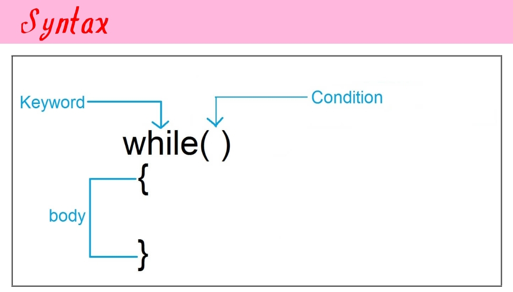
	   </div>
	   <br>


	  - **Syntax**
		1. Its body will execute until the given condition is true


		<br>

	  - **Example**


		  ```
		    #include<iostream>
			int main()
			{
				
				int i=1;
				while(i<=10)
				{
					cout<<i<<"\n";
					i++;
				}
			}


			/*
			### Output ###
			1
			2
			3
			4
			5
			6
			7
			8
			9
			10

			*/
		  ```

		  In the above program, 'i' is a variable which is initialized with '1', condition goes to 10 and it is incremented by 1 so the output will be 1 to 10. 


	<a href="../C%2B%2B%20Basic%20Tutorials/Simple%20Programs/LOOP/WHILE%20LOOP/While%20Loop%20Program%20List.md">Click for Practical Program</a>

	</details>

  - <details><summary><b>Do While Loop </b></summary>
	  - **Definition**
		- To run the body countinously untill a required condition is fullfill is called "looping".
		- It is used to perform looping operation, when the condition will become false the execution of loop will be stopped 

	   <br>

	   <div align="left">
   	   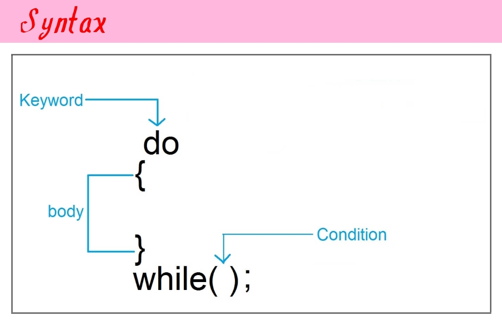
	   </div>
	   <br>

	  - **Syntax**
		1. Its body will execute until the given condition is true.


		<br>

	  - **Example**


		  ```
		    #include<iostream.h>
			int main()
			{
				int i=1;
				do
				{
					cout<<i<<"\n";
					i++;
				}
				while(i<=10);
			}


			/*
			### Output ###
			1
			2
			3
			4
			5
			6
			7
			8
			9
			10

			*/
		  ```

		  **Note:** In the above program, 'i' is a variable which is initialixed with '1', conditin goes to 10 and it is incremented by 1 so the output will be 1 to 10.


	<a href="../C%2B%2B%20Basic%20Tutorials/Simple%20Programs/LOOP/DO%20WHILE%20LOOP/Do%20While%20Loop%20Program%20List.md">Click for Practical Program</a>
	

	</details>

  - <details><summary><b>Nested Loop</b></summary>

	  - **Definition**
	  	A loop inside another loop is called "nested loop", so one 'for loop' inside another 'for loop' is called "nested loop"

	  - **Syntax**

	   <br>
	   <div align="left">
       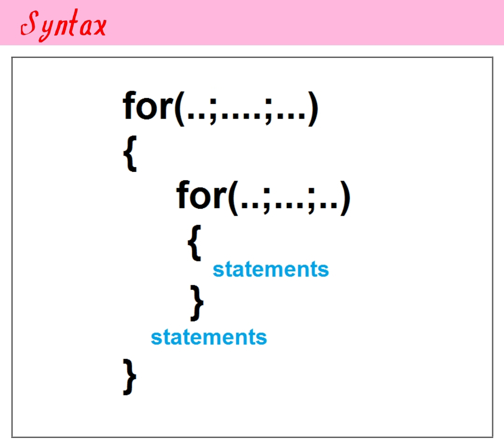
	   </div>
	   <br>
		  

	  - **Example**


		  ```
		    #include<iostream.h>
			int main()
			{
				int n;
				cout<<"Enter number upto you want to print prime number\n";
				cin>>n;
				for(int i=2;i<=n;i++)
				{
					int no=i,m=0;
					for(int j=2;j<=no-1;j++)
					{
						if(no%j==0)
						m=1;
					}
					if(m==0)
					cout<<no<<" ";
				}
				
			}


			/*
			### Output ###
			Enter number upto you want to print prime number
			20
			2 3 5 7 11 13 17 19 
			*/
		  ```


		<a href="../C%2B%2B%20Basic%20Tutorials/Simple%20Programs/LOOP/FOR%20LOOP/For%20Loop%20Program%20List.md">Click for Practical Program</a>
	</details>


</details>


<hr>

<details><summary><b>Pointer in C++</b></summary>

  - **Definition**
	1. It is a special type of variable which is used to store the address of another variable
	2. It can store the address of same data types (i.e an integer pointer can store the address of integer variable, character pointer can store the address of character variable and so on)
	3. If we add asterik(*) symbol with anny variable at the time of dclaring variable, then this variable is called "pointer variable"
	4. We use ampersand symbol to get the address of variable
	5. * symbol is used to get the value at address which is hold by pointer


	<br>
	<div align="left">
    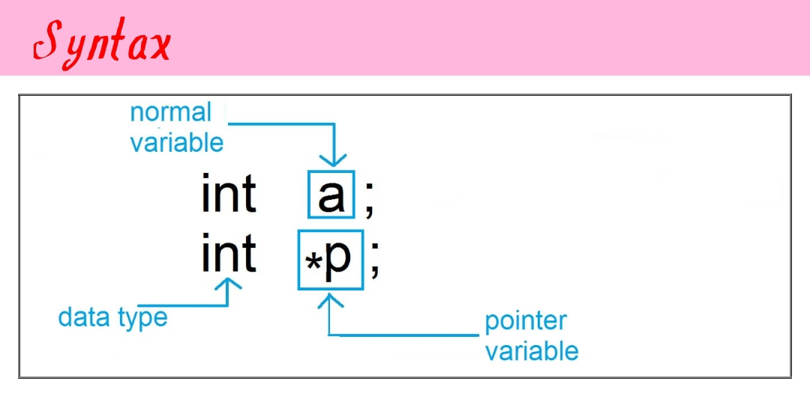
	</div>
	<br>

  - **Syntax**

	1. Here 'a' is a normal variable
	2. 'p' is apointer variable because it is associated with * symbol


<br>

  - **Example**

	```

	#include<iostream.h>
	int main()
	{
		int a=10; 	// initializing normal variable
		int *p; 	// declaring pointer variable
		p=&a; 	// address of variable a is assigned to p
		cout<<"value of a="<<a;
		cout<<"address of a="<<&a;
		cout<<"value of p="<<p;
		cout<<"address of p="<<&p;
		cout<<"value of *p="<<*P; 
	}


	/*
	### Output ###
	value of a=10
	address of a=8284
	value of p=8284
	address of p=8288
	value of *p=10

	*/


	```

  - **Output Explanation**
	Assume that the addres of variable a is 8284 and address of variable p is 8288, it may be different in your system

	   <br>
	   <div align="left">
       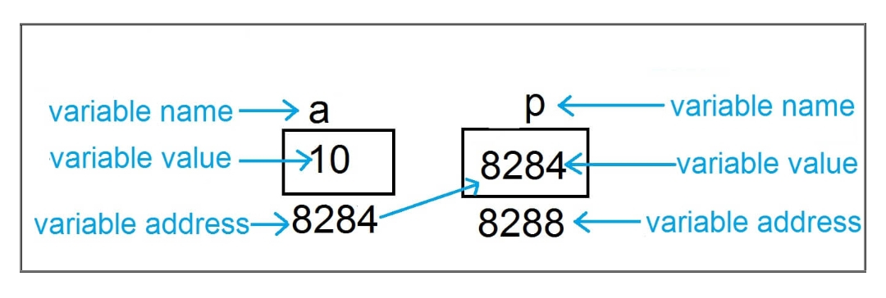
	   </div>
	   <br>


  <a href="../C%2B%2B%20Basic%20Tutorials/Simple%20Programs/POINTER/Pointer%20Program%20List.md">Click for Practical Program</a>


</details>


<hr>

<details><summary><b>Arrays in C++</b></summary>

  - <details><summary><b>Single Dimension Array </b></summary>

	  - **Definition**

		1. It is a collection of data of same data type
		2. It is used to store group of data simultaneously
		3. It can store data of the same data type (i.e an integer array can store only integer value, character array can store only character value and so on)
		4. We can not fetch data from array directly , therefore, we use index point
		5. The indexing of array alway start with '0'
		6. Index value is always an integer number
		7. Array may be of any data type like `int,char,float` etc

		<br>

	  - **Syntax**

	    <br>
	    <div align="left">
        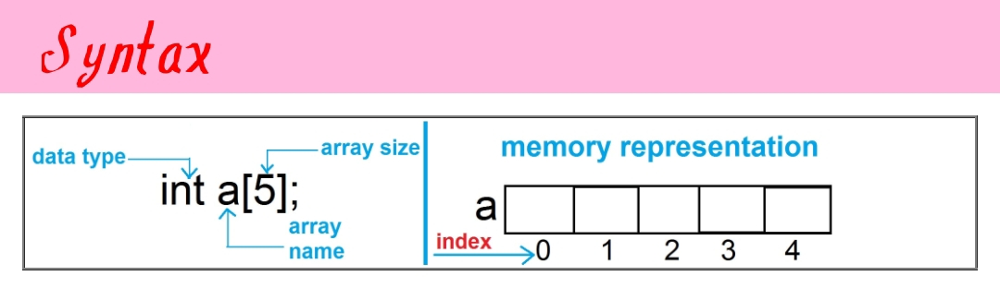
	    </div>
	    <br>

		1. Here 'a' is the name of array
		2. 'int' is the data type of array
		3. Size of array is 5 means, we can store maximum of 5 values in this array


	  - **Initialization of array (method 1)**

		<br>
	    <div align="left">
        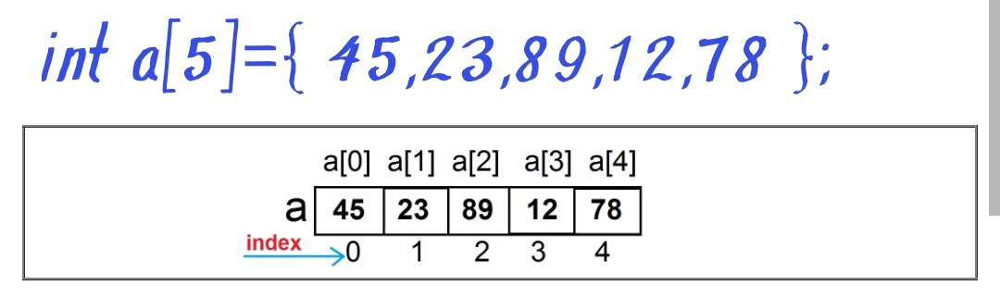
	    </div>
	    <br>


	  - **Initialization of array (method 2)**

		<br>
	    <div align="left">
        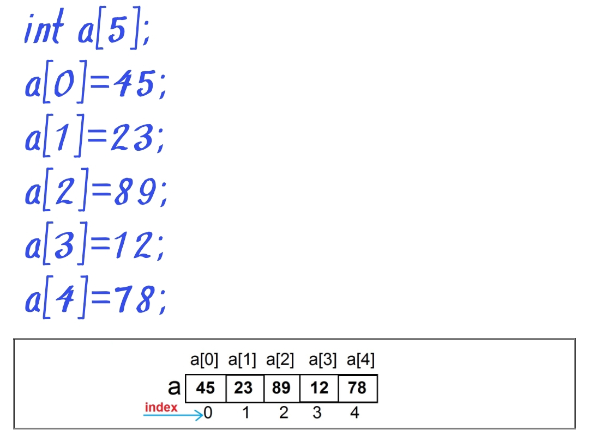
	    </div>
	    <br>

	  - **Printing of array element (method 1)**

		```

		#include<iostream>
		using namespace std;
		int main()
		{
			int a[5]={20,10,80,70,60};
			cout<<"value at a[0]="<<a[0]<<"\n";
			cout<<"value at a[1]="<<a[1]<<"\n";
			cout<<"value at a[2]="<<a[2]<<"\n";
			cout<<"value at a[3]="<<a[3]<<"\n";
			cout<<"value at a[4]="<<a[4]<<"\n";
		}


		/*
		### Output ###
		value at a[0]=20
		value at a[1]=10
		value at a[2]=80
		value at a[3]=70
		value at a[4]=60

		*/

		```


	  - **Printing of array element using loop (method 2)**

		```

		#include<iostream>
		using namespace std;
		int main()
		{
			int a[5]={20,10,80,70,60};
			for(int i=0;i<=4;i++)
			cout<<"value at a["<<i<<"]="<<a[i]<<"\n";
		}


		/*
		### Output ###
		value at a[0]=20
		value at a[1]=10
		value at a[2]=80
		value at a[3]=70
		value at a[4]=60

		*/

		```


	  - **User input in array**

		```

		#include<iostream>
		using namespace std;
		int main()
		{
			int a[5];
			cout<<"Enter element 1=";
			cin>>a[0];
			cout<<"Enter element 2=";
			cin>>a[1];
			cout<<"Enter element 3=";
			cin>>a[2];
			for(int i=0;i<=2;i++)
			cout<<"Value at a["<<i<<"]="<<a[i]<<"\n";
			
		}


		/*
		### Output ###
		Enter element 1=45
		Enter element 2=20
		Enter element 3=60
		value at a[0]=45
		value at a[1]=20
		value at a[2]=60

		*/

		```


	  - **User input in array using loop**

		```

		#include<iostream>
		using namespace std;
		int main()
		{
			int a[5],i;
			for(int i=0;i<=2;i++)
			{
				cout<<"Enter element "<<i+1<<"=";
				cin>>a[i];
			}
			for(int i=0;i<=2;i++)
			cout<<"Value at a["<<i<<"]="<<a[i]<<"\n";
			
		}


		/*
		### Output ###
		Enter element 1=45
		Enter element 2=20
		Enter element 3=60
		value at a[0]=45
		value at a[1]=20
		value at a[2]=60

		*/

		```


		<br>


		<a href="../C%2B%2B%20Basic%20Tutorials/Simple%20Programs/ARRAY/Single%20Dimension%20Array/Array%20Program%20List.md">Click for Practical Program</a>


    </details>

  - <details><summary><b>Double Dimension Array </b></summary>

	  - **Definition**

		1. It is a collection of data of same data type
		2. It is used to store group of data simultaneously
		3. It can store data of the same data type (i.e an integer array can store only integer value, character array can store only character value and so on)
		4. We can not fetch data from array directly , therefore, we use index point
		5. The indexing of array alway start with '0'
		6. Index value is always an integer number
		7. Array may be of any data type like `int,char,float` etc


		<br>

	  - **Syntax**

	    <br>
	    <div align="left">
        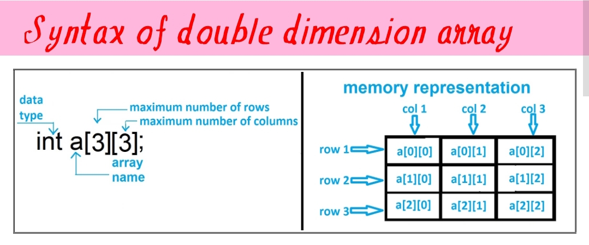
	    </div>
	    <br>

		1. Here 'a' is the name of array
		2. 'int' is the data type of array
		3. Size of array is 3x3 means, we can store maximum of 9 values in this array


	  - **Initialization of array (method 1)**

		<br>
	    <div align="left">
        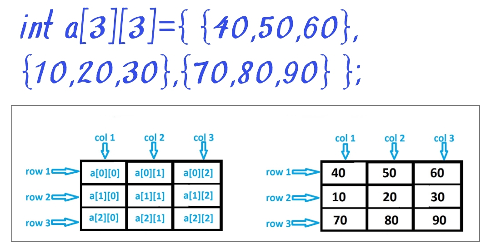
	    </div>
	    <br>


	  - **Initialization of array (method 2)**

		<br>
	    <div align="left">
        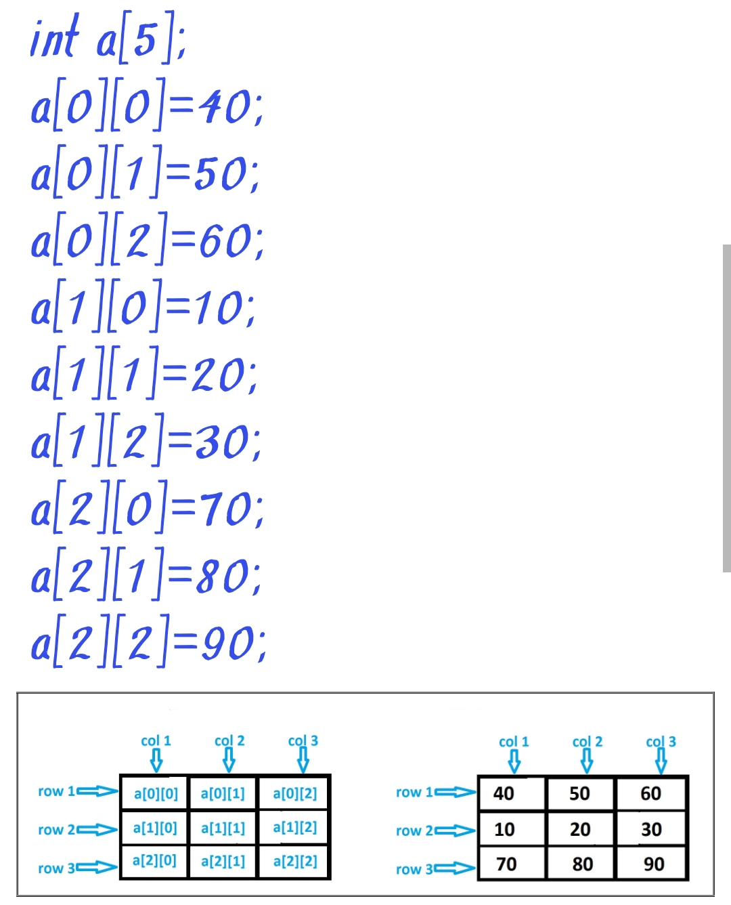
	    </div>
	    <br>

	  - **Printing of array element (method 1)**

		```

		#include<iostream>
		using namespace std;
		int main()
		{
			int a[3][3]={{10,20,30},{70,80,90},{40,50,60}};
			cout<<"value at a[0][0]="<<a[0][0]<<"\n";
			cout<<"value at a[0][1]="<<a[0][1]<<"\n";
			cout<<"value at a[0][2]="<<a[0][2]<<"\n";
			cout<<"value at a[1][0]="<<a[1][0]<<"\n";
			cout<<"value at a[1][1]="<<a[1][1]<<"\n";
			cout<<"value at a[1][2]="<<a[1][2]<<"\n";
			cout<<"value at a[2][0]="<<a[2][0]<<"\n";
			cout<<"value at a[2][1]="<<a[2][1]<<"\n";
			cout<<"value at a[2][2]="<<a[2][2]<<"\n";
			
		}


		/*
		### Output ###
		value at a[0][0]=10
		value at a[0][1]=20
		value at a[0][2]=30
		value at a[1][0]=70
		value at a[1][1]=80
		value at a[1][2]=90
		value at a[2][0]=40
		value at a[2][1]=50
		value at a[2][2]=60

		*/

		```


	  - **Printing of array element using loop (method 2)**

		```

		#include<iostream>
		using namespace std;
		int main()
		{
			int a[3][3]={{10,20,30},{70,80,90},{40,50,60}};
			for(int i=0;i<=2;i++)
			{
				for(int j=0;j<=2;j++)
				{
					cout<<[i][j]<<" ";
				}
				cout<<"\n";
			}
		}


		/*
		### Output ###
		10 20 30
		70 80 90
		40 50 60

		*/

		```


	  - **User input in array using loop**

		```

		#include<iostream>
		using namespace std;
		int main()
		{
			int a[3][3];
			int i,j;
			cout<<"Enter 9 element one by one\n";
			for(int i=0;i<=2;i++)
			  for(int j=0;j<=2;j++)
			   cin>>a[i][j];
			cout<<"Element is given below\n";
			for(int i=0;i<=2;i++)
			{
				for(int j=0;j<=2;j++)
				{
					cout<<a[i][j]<<" ";
				}
				cout<<'\n";
			}
		}


		/*
		### Output ###
		Enter 9 element one by one
		5
		6
		5
		8
		7
		9
		3
		1
		5
		Element is given below
		5 6 5
		8 7 9
		3 1 5

		*/

		```


		<br>


		<a href="../C%2B%2B%20Basic%20Tutorials/Simple%20Programs/ARRAY/Double%20Dimension%20Array/Array%20Program%20List.md">Click for Practical Program</a>


    </details>


</details>


<hr>

<details><summary><b>Functions in C++</b></summary>

  - <details><summary><b>Function </b></summary>

    - **Definition**
  
	   1. It is a collection of statement that performs a specific task
	   2. It execute when it is called by its name
	   3. A large program is devided into a number of small building block for simplicity and this building block is called function
	   4. We can call a function again and again
	   5. The most important features of function is code reusability
	   6. The C library provides many pre-defined functions 
		<br>

    - **Syntax**

		<br>
	    <div align="left">
        
	    </div>
	    <br>


    - **Key point about the function**
  
		- **Function Declaration:** At this stage the function is declared. 
  
		 For example: `void add()`

			
		- **Function Definition:** This is the place where actual code is written to perform the task.

		 For example


		```

			void add()
			{
				int x,y=20,z=30;
				x=y+z;
				cout<<"Add="<<x;
			};

		```

		

		- **Function Calling:** At this stage the function is called.

			For example: `add();`
			


    - **Complete Example**


		```

			#include <iostream>
			using namespace std;
			void add(); 	// function declarartion
			void add() 	// function definition
			{
				int x,y=20,z=30;
				x=y+z;
				cout<<"Add="<<x;
			}
			int main()
			{
				add(); 	// function calling
			}
		
	
		```

	- **Types of Function**

		There are two types of function
  
    	- **Predefined Function**
  
		The function which is predefined in the library is called predefined function. 
		Example:- `printf(), scanf(), clrscr(), getch()` etc


        - **Userdefined Function**
  
		The function is made by the user is called userdefined function.
		Example:- `add(), sub(), multi(). div()` [**Note:**  These are userdefined name, it may different]


	- **Category of Userdefined Function**
  
		There are four category of userdefined function:

  		- Function with no return type and no parameter
        - Function with no return type and with parameter
        - Function with return type and no parameter
        - Function with return type and parameter
  


	- **Function with no return type and no parameter**

		The function in which there is no value returning by that function is called **Function with no return type and no parameter**

		```

		#include<iostream>
		using namespace std;
		void add() 	// function definition
		{
			int x,y=20, z=30;
			x=y+z;
			cout<<"Add="<<x;
		}
		int main()
		{
			add(); 	// function calling
		}


		/*
		### Output ###
		Add=50
		*/

		```

		In the above example there is no parameter and no return type


	- **Function with no return type and with parameter**

		The function in which there is some parameter and there is no value returning by that function is called **Function with no return type and with parameter**


		```

		#include<iostream>
		using namespace std;
		void add(int y,int z) 	// function definition
		{
			int x;
			x=y+z;
			cout<<"Add="<<x;
		}
		int main()
		{
			add(10,20); 	// function calling
		}


		/*
		### Output ###
		Add=30
		*/

		```


		In the above example, there are two parameter of "integer" type namely 'y' and 'z' .

		There at the time of calling two integer value will be passed in which first will assign to y and second will assign to z.


	- **Function with return type and with no parameter**


		The function in which there is no parameter and there is some value returning by that function is called **Function with return type and with no parameter**


		```

		#include<iostream>
		using namespace std;
		void add() 	// function definition
		{
			int x,y=20,z=30;
			x=y+z;
			return x;
		}
		int main()
		{
			int rs=add(); 	// function calling
			cout<<"Add="<<rs; 
		}


		/*
		### Output ###
		Add=50
		*/

		```


		In the above example, there is no parameter but the function will return integer value because there is **int** keyword in the place of return type and return value will assign to variable **rs**.


	- **Function with return type and with parameter**	

		The function in which there is some parameter and there is some value returning by that function is called **Function with return type and with parameter**


		```

		#include<iostream>
		using namespace std;
		void add(int y,int z) 	// function definition
		{
			int x;
			x=y+z;
			return x;
		}
		int main()
		{
			int rs=add(50,30) 	// function calling
			cout<<"Add="<<rs;
		}


		/*
		### Output ###
		Add=80
		*/

		```


		In the above example, there is no parameter but the function will return integer value because there is **int** keyword in the place of return type and returned value will assign to variables **rs**


	- **Calling of Function**

		There are two ways of calling function:

		- Call By Value
		- Call By Reference


	- **Call By Value**

		In this type of calling a function direct value is passed at the time of calling.


		```

		#include<iostream>
		using namespace std;
		void add(int y,int z) 	// function definition
		{
			int x;
			x=y+z;
			cout<<"Add="<<x;
		}
		int main()
		{
			add(10,20); 	// function calling
		}


		/*
		### Output ###
		Add=30
		*/

		```

		In the above example we can see that direct value is passed at the time of calling.


	- **Call By Reference**


		1. In ths type of calling a function, the reference of the value is passed at the time of calling
		2. Reference is also called address
		3. When the address of data is passed at the time of calling so it is neccessary to use **pointer** in the place of parameter.
		4. For better understanding, see the example below:-


	 
	
		```

		#include<iostream>
		using namespace std;
		void sum(int *p,int *q) 	// function definition
		{
			int result=*p + *q;
			cout<<"Sum="<<result;
		}
		int main()
		{
			int x=10, y=20;
			// reference of variable is get using ampersand(&) operator
			sum(&x,&y); 	// function calling with refrence/address
		}


		/*
		### Output ###
		Add=30
		*/

		```


		In the above example, we can see that **x** and **y** are normal variable and reference of that variables are passed at the time of calling.


	- **Function with default value**

		- In this type of function, the functions contains a number of parameter with some initial value 
			**[for example: `void sum(int x=10,int y=20)`]**
		- At the etime of calling if there is no value is passed
			**[for example: `sum();`]** 
			then the default value will be x=10 and y=20, but if value passed 
			**[for example: `sum(5,6);`]** 
			then the value will be x=5 and y=6

		- For better understanding see the example below:


		```

		#include<iostream>
		using namespace std;
		void sum(int x=10,int y=20) 	// function definition
		{
			int result=x + y;
			cout<<"Add="<<result<<"\n";
		}
		int main()
		{
			int x=10, y=20;
			cout<<"Without value\n";
			sum(); 	// function calling without value
			cout<<"With value\n";
			sum(5,6); 	// function calling with value
			
		}


		/*
		### Output ###
		Without value
		Add=30
		With value
		Add=11
		*/

		```


	- **Passing Array to Function**

		In this type of function, there is an array in the place of parameter
		**[for example: `void sum(int ar[5])`]** and its value is passed at the time of calling.


		```

		#include<iostream>
		using namespace std;
		void sum(int ar[5]) 	// function definition
		{
			int s=0;
			for(int i=0;i<5;i++)
			s=s+ar[i];
			cout<<"Total suum of element="<<s;
		}
		int main()
		{
			int x[5]={10,20,50,40,60};
			sum(x); 	// function calling with array
			
		}


		/*
		### Output ###
		Total sum of element=180
		*/

		```

		In the above example, we can see that there is an array **ar[5]** in place of parameter and there as another array **x[5]={10,20,50,40,60}** and it is passed at the etime of calling therefore the value of array x will be copied into array ar.


	- **Recursion**


		The process of calling a function by itself is called **Recursion** and the function that calls itself is called **Recursive Function**.


		*Factorial of any Number using recursion <br> Factorial of 5=5*4*3*2*1*


		```

		#include<iostream>
		using namespace std;
		void factorial(int no,int f) 	// function definition
		{
			if(no>=1)
			{
				f=f*no;
				no--;
				factorial(no,f);
			}
			else
			cout<<"Factorial ="<<f;
		}
		int main()
		{
			int n;
			cout<<"Enter any number to find factorial\n";
			cin>>n;
			factorial(n,1); 	// function calling with array
			
		}


		/*
		### Output ###
		Enter any number to find factorial
		6
		Factorial =720
		*/

		```

	
		<a href="/Simple%20Programs/FUNCTION/Function%20Program%20List.md">Click for Practical Program</a>

  	</details>


  - <details><summary><b>String Function</b></summary>

	- **Definition**
  
	   1. Sring is a collection of character
	   2. C does not support string data type. Therefore char data type is used to make string
	   3. String in C is stored in single dimension character array
	   4. There are many predefined string function in C library
	   5. All the string functions are predefined in `string.h` header file


		<br>
	    <div align="left">
        
	    </div>
	    <br>


    - **strlen(s)**

		```

		#include<iostream.h>
		#include<conio.h>
		#include<string.h>
		int main()
		{
			char name[200]="Easy";
			cout<<strlen(name);
			return 0;
		}


		/*
		### Output ###
		4 	// because there is 4 character in Easy
		*/

		```


		<br><br>

    - **strcpy(s1,s2)**

		```

		#include<iostream.h>
		#include<conio.h>
		#include<string.h>
		int main()
		{
			char name1[200]="Prosper";
			char name2[200]="Nemo";
			strcpy(name1,name2);
			cout<<name1;
			return 0;
		}


		/*
		### Output ###
		Nemo
		*/

		```

		<br><br>

    - **strcmp(s1,s2)**


		```

		#include<iostream.h>
		#include<conio.h>
		#include<string.h>
		int main()
		{
			char s1[200]="Easy";
			char s2[200]="Easy";
			if(strcmp(s1,s2)==0);
			{
				cout<<"string s1 and string s2 are same.";
			}
			else
			{
				cout<<"string s1 and string s2 are not same.";
			}
			return 0;
		}


		/*
		### Output ###
		string s1 and string s2 are same.
		*/

		```

		<br><br>


	- **strcat(s1,s2)**


		```

		#include<iostream.h>
		#include<conio.h>
		#include<string.h>
		int main()
		{
			char s1[200]="Easy";
			char s2[200]="Programming";
			cout<<,strcat(s1,s2);
			return 0;
			
		}


		/*
		### Output ###
		Easy Programming
		*/

		```

		<br><br>


	- **strrev(s)**


		```

		#include<iostream.h>
		#include<conio.h>
		#include<string.h>
		int main()
		{
			char s1[200]="ABCD";
			cout<<,strrev(s);
			return 0;
			
		}


		/*
		### Output ###
		DCBA
		*/

		```

		<br><br>


	- **strupr(s)**


		```

		#include<iostream.h>
		#include<conio.h>
		#include<string.h>
		int main()
		{
			char s[200]="Easy";
			cout<<,strupr(s);
			return 0;
			
		}


		/*
		### Output ###
		EASY
		*/

		```

		<br><br>


	- **strlwr(s)**


		```

		#include<iostream.h>
		#include<conio.h>
		#include<string.h>
		int main()
		{
			char s[200]="Easy";
			cout<<,strlwr(s);
			return 0;
			
		}


		/*
		### Output ###
		easy
		*/

		```

		<br><br>


	


		<a href="/Simple%20Programs/FUNCTION/String%20Program%20List.md">Click for Practical Program</a>
	
  

    </details>

  - <details><summary><b>Math Function</b></summary>
  
    - **Definition**
  
	   1. It is used to perform the mathematical related operation
	   2. There are many predefined math function in C libray
	   3. All the math function are predefined in `math.h` header file


		<br>
	    <div align="left">
        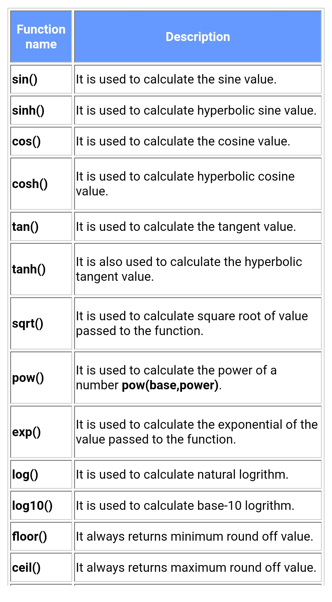
		<br>
		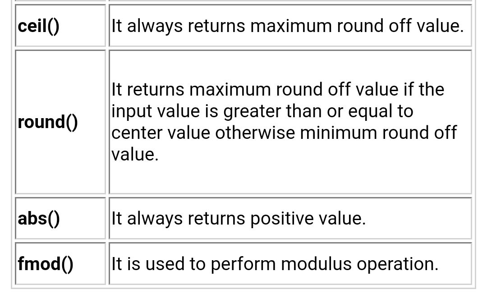
	    </div>
	    <br>


    - **Example:**

		```

		#include<iostream.h>
		#include<conio.h>
		#include<math.h>
		int main()
		{
			float a=2;
			cout<<"sin(2)="<<sin(a)<<"\n";
			cout<<"sin(2)="<<cos(a)<<"\n";
			cout<<"sin(2)="<<tan(a)<<"\n";
			cout<<"sin(2)="<<exp(a)<<"\n"; 	// exponential
			cout<<"sin(2)="<<log(a)<<"\n";	 // natural log
			cout<<"sin(2)="<<log10(a)<<"\n"; 	// log10
			cout<<"sin(2)="<<sqrt(a)<<"\n"; 	// square root
			cout<<"sin(2)="<<cbrt(a)<<"\n"; 	// cube root
			return 0;
		}


		/*
		### Output ###
		sin(2)=0.909
		cos(2)=-0.416
		tan(2)=-2.185
		exp(2)=7.389
		log(2)=0.693
		log10(2)=0.301
		sqrt(4)=2
		cbrt(27)=3
		*/
			

		```

		
    - **floor() function:- It always return minimum round off value**

		

		```

		#include<iostream.h>
		#include<conio.h>
		#include<math.h>
		int main()
		{
			cout<<"sin(2)="<<floor(2.3)<<"\n";
			cout<<"sin(2)="<<floor(2.5)<<"\n";
			cout<<"sin(2)="<<floor(2.8)<<"\n";
			return 0;
		}


		/*
		### Output ###
		2.0
		2.0
		2.0
		*/


		```


	- **ceil() function:- It always return maximum round of value**

		

		```

		#include<iostream.h>
		#include<conio.h>
		#include<math.h>
		int main()
		{
			cout<<"sin(2)="<<ceil(2.3)<<"\n";
			cout<<"sin(2)="<<ceil(2.5)<<"\n";
			cout<<"sin(2)="<<ceil(2.8)<<"\n";
			return 0;
		}


		/*
		### Output ###
		3.0
		3.0
		3.0
		*/
			

		```


	- **round() function**

		

		```

		#include<iostream.h>
		#include<conio.h>
		#include<math.h>
		int main()
		{
			cout<<"sin(2)="<<round(2.3)<<"\n";
			cout<<"sin(2)="<<round(2.5)<<"\n";
			cout<<"sin(2)="<<round(2.8)<<"\n";
			return 0;
		}


		/*
		### Output ###
		2.0
		3.0
		3.0
		*/
			

		```

   
   
   </details>


</details>


<hr>

<details><summary><b>Structure in C++</b></summary>

  - <details><summary><b>Structure </b></summary>

    - **Definition**
  
	   1. It is a collection of data of different data type
	   2. It is a user define data type
	   3. Data can be of `int, char, float, double` etc data type
	   4. We can access the member of structure by making the variable of structure
	   5. `struct` keyword is used to create a structure


    - **Syntax**

		<br>
	    <div align="left">
        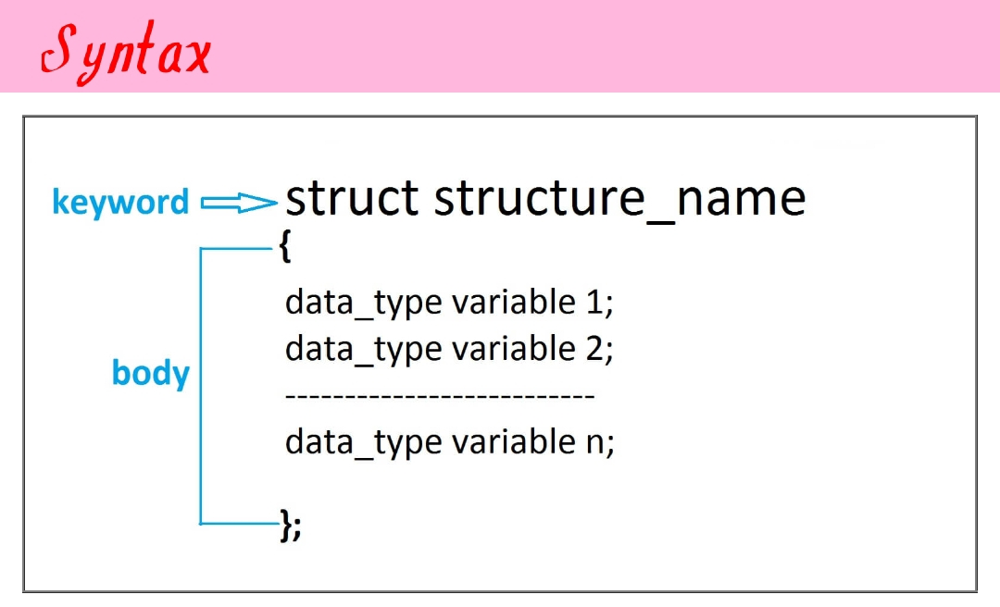
	    </div>
	    <br>

    - **Example:**

		```

			struct student
			{
				char name[200];
				int rollno;
				float marks;
			};

		```

		Here: 
    	1. student is the name of structure
    	2. struct is a keyword


    - **Example:- Write a program to store and display the student name, rollno and marks**


		```

			#include <iostream.h>
			#include <string.h>
			struct student
			{
				char name[200];
				int rollno;
				float marks;
			};
			int main()
			{
				struct student student1; 	// declaring structure variable
				strcpy(student1.name,"Nemo");
				student1.rollno=201;
				student1.marks=85.9;
					cout<<"Student Name="<<student1.name<<"\n";
					cout<<"Student Rollno="<<student1.rollno<<"\n";
					cout<<"Student Marks="<<student1.marks<<"\n";
			}
		
	
			### output ###
			Student Name=Nemo
			Student Rollno=201
			Student Marks=85.9

		```


	<a href="/C%2B%2B%20Basic%20Tutorials/Simple%20Programs/STRUCTURE/Structure%20Program%20List.md">Click for Practical Program</a>

  	</details>


  - <details><summary><b>Union</b></summary>

	- **Definition**
  
	   1. It is a collection of data of different data type
	   2. It is a user define data type
	   3. Data can be of `int, char, float, double` etc data type
	   4. We can access the member of union by making the variable of union
	   5. `union` keyword is used to create a union
	   6. **Note:** Union does not support multiple value simultaneously. <br> It can only store one value at a time.


    - **Syntax**

		<br>
	    <div align="left">
        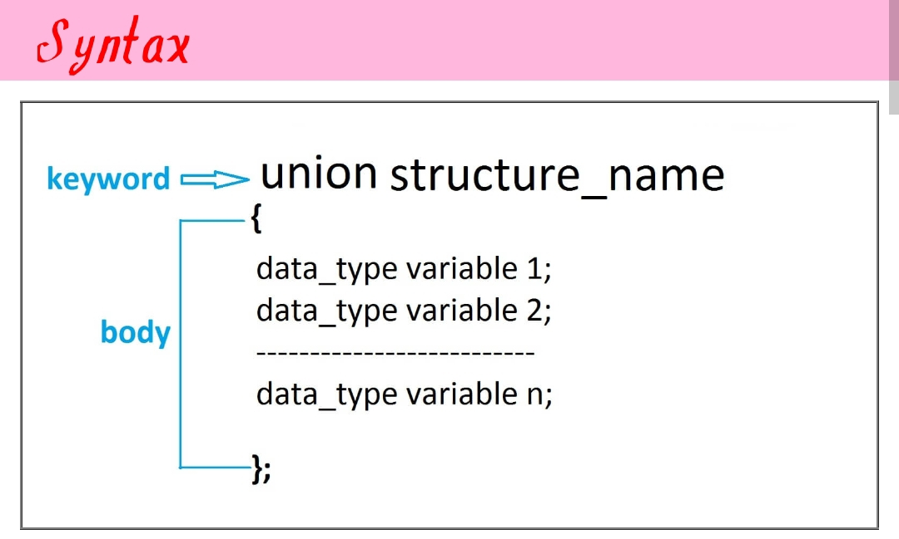
	    </div>
	    <br>


		

    - **Example:**

		```

			union student
			{
				char name[200];
				int rollno;
				float marks;
			};

		```

		Here: 
    	1. student is the name of union
    	2. union is a keyword


    - **Example:- Write a program to store and display the student name, rollno and marks**

		**Note:** 
		- Union will show only one last value correct cause it can store only single value at a time
		- I am writing this program here so you can understsand difference b/w structure and union better


		```

			#include <iostream.h>
			#include <string.h>
			union student
			{
				char name[200];
				int rollno;
				float marks;
			};
			int main()
			{
				union student student1; 	// declaring structure variable
				strcpy(student1.name,"Nemo");
				student1.rollno=201;
				student1.marks=85.9;
					cout<<"Student Name="<<student1.name<<"\n";
					cout<<"Student Rollno="<<student1.rollno<<"\n";
					cout<<"Student Marks="<<student1.marks<<"\n";
			}
		
	
			### output ###
			Student Name=garbage value
			Student Rollno=garbage value
			Student Marks=85.9

		```


	<a href="/C%2B%2B%20Basic%20Tutorials/Simple%20Programs/STRUCTURE/Union%20Program%20List.md">Click for Practical Program</a>
	
  

    </details>

  - <details><summary><b>Enumeration</b></summary>
  
    - **Definition**
  
	   1. It is a collection of named integer constant
	   2. It is a user define data type
	   3. `enum` keyword is used to create a enumeration
	   4. **Note:** Union does not support multiple value simultaneously. <br> It can only store one value at a time.


    - **Syntax**

		<br>
	    <div align="left">
        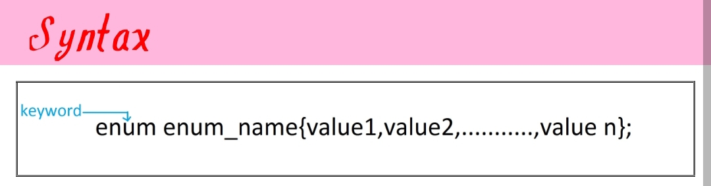
	    </div>
	    <br>

    - **Example:**

		```

			enum week {sunday,monday,tuesday,wednesday,thursday,friday,saturday};

		```

		Here: 
    	1. enum is a keyword
    	2. week is the name of union and its a user defined data type
    	3. sunday,monday,tuesday,wednesday,thursday,friday,saturday are the values of enum


	- **Default numerical value of the member of enum is given below:**

		- Default value of sunday is 0
		- Default value of monday is 1
		- Default value of tuesday is 2
		- Default value of wednesday is 3
		- Default value of thursday is 4
		- Default value of friday is 5
		- Default value of saturday is 6

		for better understanding, see the below example:


    - **Example 1:-**

		

		```

			#include <iostream.h>
			using namespace std;
			enum week {sunday,monday,tuesday,wednesday,thursday,friday,saturday};
			int main()
			{
				enum week obj;
				obj=wednesday;
				cout<<"Value of wenesday"<<obj;
			}
			
	
			### output ###
			Value of wenesday=3
			

		```


	- **Example:- We can aslo change the default value of member of enum**

		

		```

			#include <iostream.h>
			using namespace std;
			enum week {sunday=20,monday=50,tuesday=18,wednesday=95,thursday=84,friday=60,saturday=55};
			int main()
			{
				enum week obj;
				obj=wednesday;
				cout<<"Value of wenesday"<<obj;
			}
			
	
			### output ###
			Value of wenesday=95
			

		```


	<a href="/C%2B%2B%20Basic%20Tutorials/Simple%20Programs/STRUCTURE/Enumeration%20Program%20List.md">Click for Practical Program</a>
   
   
   
   </details>


</details>


<hr>

<details><summary><b>File Handling in C++</b></summary>


- **Definition**
  

	1. File handling is mechanism to store the output of a program into a file and read from the file on the disk permanently

	2. `fstream` header file is used to perform file operator in C++, this header file provides many classes `(ifstream, ofstream, fstream)` to read from a file and write into a file

	3. **ofstream:** This data type represenets the output file stream and is used to create files and to write information to files

	4. **ifstream:** This data type represents the input file stream and is used to read information from files

	5. **fstream:** This data type represents the file stream generally, and has the capabilities of both `ofstream` and `ifstream` which means it can create files, write information to files, and read information from files.


- **Operation on File**


	1. Opening of file
	2. Writing into a file
	3. Appending data into a file
	4. Reading from a file
	5. Closing of file


- **File Opening Modes**
  

	- In C++ File can be open in different mode to perform read and write operation on a file.
	- `open()` function is used to open a file 
	- open functions takes two arguments
	`open(const char *filename, ios::openmode mode);`
	- Different file opening mode is given below:

	    <br>
	    <div align="left">
        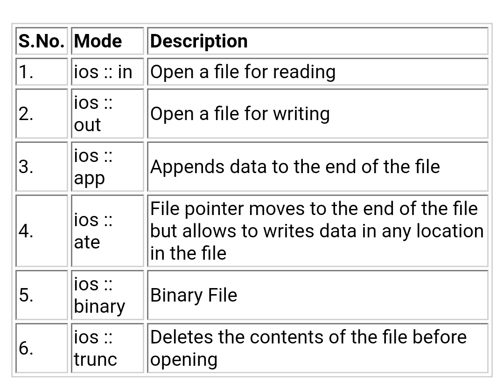
	    </div>
	    <br>


<br>

- **Writing into a file**

	```
	#include <iostream>
	#include <fstream>
	using namespace std;
	int main() {
		ofstream ofile; 	// making object of class ofstream
		ofile.open("easy.txt"); 	// open "easy.txt" for writing data

		// write to a file
		ofile << "Nemonet TYP" << end1;
		ofile << "An ISO 9001:2023 Certified Programmer" << end1;
		ofile.close(); 	// close the file
		return 0;
	}

	```


<br>

- **Reading from a file**


	```
	#include <iostream>
	#include <fstream>
	using namespace std;
	int main() 
	{
		char str[100]; 	// Declaring variables to store data from file
		ifstream ifile; 	// making object of class ifstream
		ifile.open("easy.txt"); 	// open "easy.txt" for reading
		cout << "Content of easy.txt file is given below :-"<<end1;

		// while the end of file [ eof() ] is not reached
		while (!ifile.eof()) {
			ifile.getline(str, 100); 	// read a line from file
			cout << str << end1; 	// print the file content
		}
		ifile.cose(); 	// close the file
	}

	```

<br>


- **Example: Count number of alphabet in a file**
  

	```
	#include <iostream>
	#include <fstream>
	using namespace std;
	int main() 
	{
		ifstream fin("easy.txt");
			char ch;
			int i,alpha=0;
			while(fin)
			{
				fin.get(ch);
				i=ch;
				if((i >=65 && i <=90) || (i >=97 && i <=122))
				alpha++;
			}
			cout<<"\n No. of alphabelt in easy.txt file : "<<alpha;
	}

	/* 
	easy.txt must exist in your system
	*/

	```

<br>

- **Example: Count number of digits in a file**
  

	```
	#include <iostream>
	#include <fstream>
	using namespace std;
	int main() 
	{
		ifstream fin("easy.txt");
			char ch;
			int i,digit=0;
			while(fin)
			{
				fin.get(ch);
				i=ch;
				if(i >=48 && i <=57)
				dgit++;
			}
			cout<<"\n No. of digits in easy.txt file : "<<digit;
	}

	/* 
	easy.txt must exist in your system
	*/

	```

<br>

- **Example: Count number of special symbol in a file**
  

	```
	#include <iostream>
	#include <fstream>
	using namespace std;
	int main() 
	{
		ifstream fin("easy.txt");
			char ch;
			int i,ss=0;
			while(fin)
			{
				fin.get(ch);
				i=ch;
				if((i >=65 && i <=90) || (i >=97 && i <=122))
				{}
				else if(i >=48 && i <=57)
				{}
				else
				ss++;
			}
			cout<<"\n No. of special symbol in easy.txt file : "<<ss;
	}

	/* 
	easy.txt must exist in your system
	*/

	```

<br>


- **Example: Count number of space in a file**
  

	```
	#include <iostream>
	#include <fstream>
	using namespace std;
	int main() 
	{
		ifstream fin("easy.txt");
			char ch;
			int i,space=0;
			while(fin)
			{
				fin.get(ch);
				i=ch;
				if(ch=='')
				space++;
			}
			cout<<"\n No. of space in easy.txt file : "<<space;
	}

	/* 
	easy.txt must exist in your system
	*/

	```

</details>


<br><br><br>


**Note:** 
 - This Tutorial is mainly Practical.
 - Give a STAR if you like this 
 - FORK to get more update
 - Make a PULL REQUEST to countribute


